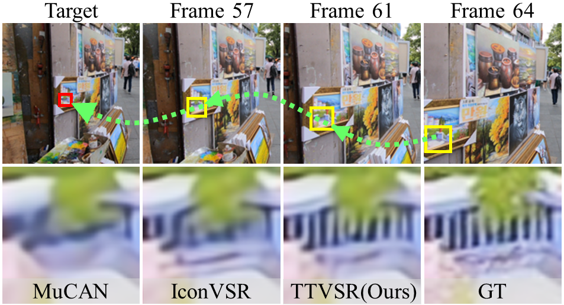
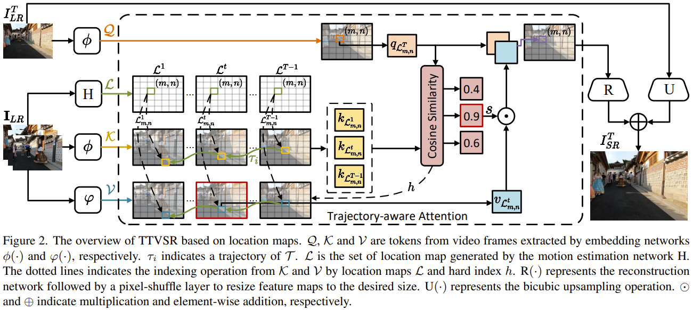
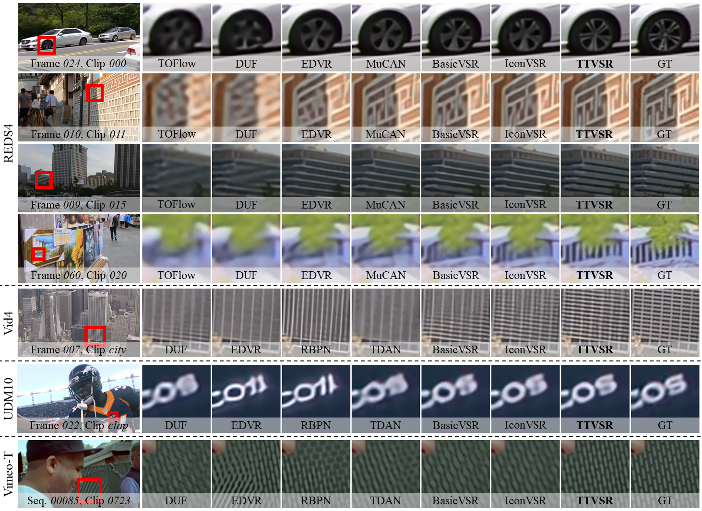

# TTVSR (CVPR2022, Oral)
This is the official PyTorch implementation of the paper [Learning Trajectory-Aware Transformer for Video Super-Resolution](https://arxiv.org/abs/2204.04216).

## Contents
- [Introduction](#introduction)
  - [Contribution](#contribution)
  - [Overview](#overview)
  - [Visual](#Visual)
- [Requirements and dependencies](#requirements-and-dependencies)
- [Model and results](#model-and-results)
- [Dataset](#dataset)
- [Test](#test)
- [Train](#train)
- [Related projects](#related-projects)
- [Citation](#citation)
- [Acknowledgment](#acknowledgment)
- [Contact](#contact)


## Introduction
We proposed an approach named TTVSR to study video super-resolution by leveraging long-range frame dependencies. TTVSR introduces Transformer architectures in video super-resolution tasks and formulates video frames into pre-aligned trajectories of visual tokens to calculate attention along trajectories.


### Contribution
We propose a novel trajectory-aware Transformer, which is one of the first works to introduce Transformer into video super-resolution tasks. TTVSR reduces computational costs and enables long-range modeling in videos. TTVSR can outperform existing SOTA methods in four widely-used VSR benchmarks.


### Overview


### Visual


## Requirements and dependencies
* python 3.7 (recommend to use [Anaconda](https://www.anaconda.com/))
* pytorch == 1.9.0
* torchvision == 0.10.0
* opencv-python == 4.5.3
* mmcv-full == 1.3.9
* scipy==1.7.3
* scikit-image == 0.19.0
* lmdb == 1.2.1
* yapf == 0.31.0
* tensorboard == 2.6.0

## Model and results
Pre-trained models can be downloaded from [onedrive](https://1drv.ms/u/s!Au4fJlmAZDhlhwKdJU12DvvdSY0o?e=0lCRDN), [google drive](https://drive.google.com/drive/folders/1dXzyi_9nMLC3FU7SKkvLEGOMyv0lfcV2?usp=sharing), and [baidu cloud](https://pan.baidu.com/s/1xjGCnChxFxFcPs0cBVZ-ew)(nbgc).
* *TTVSR_REDS.pth*: trained on REDS dataset with BI degradation.
* *TTVSR_Vimeo90K.pth*: trained on Vimeo-90K dataset with BD degradation.

The output results on REDS4, Vid4 and UMD10 can be downloaded from [onedrive](https://1drv.ms/u/s!Au4fJlmAZDhlhwKdJU12DvvdSY0o?e=0lCRDN), [google drive](https://drive.google.com/drive/folders/1dXzyi_9nMLC3FU7SKkvLEGOMyv0lfcV2?usp=sharing), and [baidu cloud](https://pan.baidu.com/s/1xjGCnChxFxFcPs0cBVZ-ew)(nbgc).


## Dataset

1. Training set
	* [REDS](https://seungjunnah.github.io/Datasets/reds.html) dataset. We regroup the training and validation dataset into one folder. The original training dataset has 240 clips from 000 to 239. The original validation dataset were renamed from 240 to 269.
		- Make REDS structure be:
	    ```
			├────REDS
				├────train
					├────train_sharp
						├────000
						├────...
						├────269
					├────train_sharp_bicubic
						├────X4
							├────000
							├────...
							├────269
        ```
	* [Viemo-90K](https://github.com/anchen1011/toflow) dataset. Download the [original training + test set](http://data.csail.mit.edu/tofu/dataset/vimeo_septuplet.zip) and use the script 'degradation/BD_degradation.m' (run in MATLAB) to generate the low-resolution images. The `sep_trainlist.txt` file listing the training samples in the download zip file.
		- Make Vimeo-90K structure be:
		```
			├────vimeo_septuplet
				├────sequences
					├────00001
					├────...
					├────00096
				├────sequences_BD
					├────00001
					├────...
					├────00096
				├────sep_trainlist.txt
				├────sep_testlist.txt
        ```

2. Testing set
	* [REDS4](https://seungjunnah.github.io/Datasets/reds.html) dataset. The 000, 011, 015, 020 clips from the original training dataset of REDS.
    * [Viemo-90K](https://github.com/anchen1011/toflow) dataset. The `sep_testlist.txt` file listing the testing samples in the download zip file.
    * [Vid4 and UDM10](https://www.terabox.com/web/share/link?surl=LMuQCVntRegfZSxn7s3hXw&path=%2Fproject%2Fpfnl) dataset. Use the script 'degradation/BD_degradation.m' (run in MATLAB) to generate the low-resolution images.
		- Make Vid4 and UDM10 structure be:
		```
			├────VID4
				├────BD
					├────calendar
					├────...
				├────HR
					├────calendar
					├────...
			├────UDM10
				├────BD
					├────archpeople
					├────...
				├────HR
					├────archpeople
					├────...
        ```

## Test
1. Clone this github repo
```
git clone https://github.com/researchmm/TTVSR.git
cd TTVSR
```
2. Download pre-trained weights ([onedrive](https://1drv.ms/u/s!Au4fJlmAZDhlhwKdJU12DvvdSY0o?e=0lCRDN)|[google drive](https://drive.google.com/drive/folders/1dXzyi_9nMLC3FU7SKkvLEGOMyv0lfcV2?usp=sharing)|[baidu cloud](https://pan.baidu.com/s/1xjGCnChxFxFcPs0cBVZ-ew)(nbgc)) under `./checkpoint`
3. Prepare testing dataset and modify "dataset_root" in `configs/TTVSR_reds4.py` and `configs/TTVSR_vimeo90k.py`
4. Run test
```
# REDS model
CUDA_VISIBLE_DEVICES=0,1,2,3,4,5,6,7 ./tools/dist_test.sh configs/TTVSR_reds4.py checkpoint/TTVSR_REDS.pth 8 [--save-path 'save_path']
# Vimeo model
CUDA_VISIBLE_DEVICES=0,1,2,3,4,5,6,7 ./tools/dist_test.sh configs/TTVSR_vimeo90k.py checkpoint/TTVSR_Vimeo90K.pth 8 [--save-path 'save_path']
```
5. The results are saved in `save_path`.

## Train
1. Clone this github repo
```
git clone https://github.com/researchmm/TTVSR.git
cd TTVSR
```
2. Prepare training dataset and modify "dataset_root" in `configs/TTVSR_reds4.py` and `configs/TTVSR_vimeo90k.py`
3. Run training
```
# REDS
CUDA_VISIBLE_DEVICES=0,1,2,3,4,5,6,7 ./tools/dist_train.sh configs/TTVSR_reds4.py 8
# Vimeo
CUDA_VISIBLE_DEVICES=0,1,2,3,4,5,6,7 ./tools/dist_train.sh configs/TTVSR_vimeo90k.py 8
```
4. The training results are saved in `./ttvsr_reds4` and `./ttvsr_vimeo90k` (also can be set by modifying "work_dir" in `configs/TTVSR_reds4.py` and `configs/TTVSR_vimeo90k.py`)

## Related projects
We also sincerely recommend some other excellent works related to us. :sparkles: 
* [TTSR: Learning Texture Transformer Network for Image Super-Resolution](https://github.com/researchmm/TTSR)
* [CKDN: Learning Conditional Knowledge Distillation for Degraded-Reference Image Quality Assessment](https://github.com/researchmm/CKDN)

## Citation
If you find the code and pre-trained models useful for your research, please consider citing our paper. :blush:
```
@InProceedings{liu2022learning,
author = {Liu, Chengxu and Yang, Huan and Fu, Jianlong and Qian, Xueming},
title = {Learning Trajectory-Aware Transformer for Video Super-Resolution},
booktitle = {CVPR},
year = {2022},
month = {June}
}
```

## Acknowledgment
This code is built on [mmediting](https://github.com/open-mmlab/mmediting). We thank the authors of [BasicVSR](https://github.com/ckkelvinchan/BasicVSR-IconVSR) for sharing their code.

## Contact
If you meet any problems, please describe them in issues or contact:
* Chengxu Liu: <liuchx97@gmail.com> 

